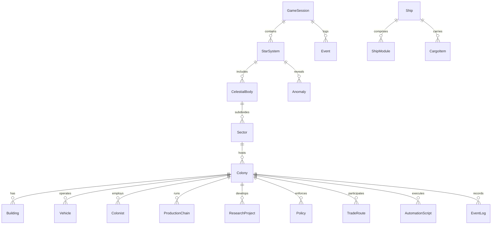

# Entities

## 1. **Global Layer Entities**

### **GameSession**

Represents the overall simulation and persistent state of a single playthrough.

| Property           | Type                                     | Description                                     |
| ------------------ | ---------------------------------------- | ----------------------------------------------- |
| id                 | UUID                                     | Unique session identifier                       |
| player             | `PlayerProfile`                          | Current player configuration                    |
| difficulty         | Enum(`Easy`, `Normal`, `Hard`, `Custom`) | Modifies failure tolerance and event frequency  |
| game_time          | Float                                    | Current simulation time in hours/days           |
| active_system      | Ref(`StarSystem`)                        | Current focus system                            |
| discovered_systems | List[`StarSystem`]                       | Systems revealed by exploration                 |
| save_metadata      | Dict                                     | Includes save name, timestamp, and version info |
| settings           | Dict                                     | Gameplay toggles, mods, accessibility           |

---

### **PlayerProfile**

| Property           | Type                | Description                       |
| ------------------ | ------------------- | --------------------------------- |
| name               | String              | Player-entered name               |
| call_sign          | String              | Short identifier used in messages |
| selected_ship_type | Ref(`ShipType`)     | Chosen mission ship               |
| selected_system    | Ref(`StarSystem`)   | Target star system for mission    |
| achievements       | List[`Achievement`] | Unlocked achievements             |

---

### **Event**

Represents a triggered narrative or simulation event.

| Property          | Type                | Description                                                         |
| ----------------- | ------------------- | ------------------------------------------------------------------- |
| id                | UUID                | Event instance                                                      |
| event_type        | Enum                | Category (`MechanicalFailure`, `SocialConflict`, `Discovery`, etc.) |
| trigger_condition | Expression          | Boolean expression on game state                                    |
| options           | List[`EventOption`] | Player choices                                                      |
| outcomes          | Dict                | State deltas on choice                                              |
| affected_entities | List[Refs]          | Entities modified                                                   |
| timestamp         | Float               | In-game time                                                        |
| log_entry         | String              | Description for `EventLog`                                          |

---

### **Achievement**

| Property    | Type       | Description           |
| ----------- | ---------- | --------------------- |
| id          | UUID       | Identifier            |
| name        | String     | Display name          |
| description | String     | Summary text          |
| criteria    | Expression | Condition to unlock   |
| unlocked_at | Float      | In-game time achieved |

## 2. **Ship Layer Entities**

### **Ship**

Represents the interstellar vessel carrying the initial colony.

| Property        | Type                          | Description                     |
| --------------- | ----------------------------- | ------------------------------- |
| id              | UUID                          | Ship identifier                 |
| name            | String                        | Player-chosen or generated name |
| ship_type       | Enum(`Generation`, `Sleeper`) | Determines simulation model     |
| integrity       | Float (0–1)                   | Physical health of ship         |
| power_reserve   | Float                         | Remaining energy                |
| morale          | Float                         | Crew morale index               |
| population      | List[`Colonist`]              | People onboard                  |
| cargo           | List[`CargoItem`]             | Items and equipment carried     |
| modules         | List[`ShipModule`]            | Structural components           |
| journey_log     | List[`Event`]                 | Voyage events                   |
| destination     | Ref(`StarSystem`)             | Target system                   |
| travel_progress | Float (0–1)                   | Fraction of distance covered    |
| time_elapsed    | Float                         | Years passed in transit         |

### **ShipModule**

| Property     | Type                                                                        | Description                  |
| ------------ | --------------------------------------------------------------------------- | ---------------------------- |
| id           | UUID                                                                        | Unique module identifier     |
| module_type  | Enum(`LifeSupport`, `Reactor`, `CryoBay`, `Habitat`, `DriveCore`, `Bridge`) | Functional type              |
| condition    | Float                                                                       | Wear and tear                |
| power_draw   | Float                                                                       | Energy consumption           |
| dependencies | List[`ShipModule`]                                                          | Modules required to function |
| status       | Enum(`Active`, `Offline`, `Damaged`)                                        | Operational state            |

### **CargoItem**

| Property  | Type                                                                             | Description       |
| --------- | -------------------------------------------------------------------------------- | ----------------- |
| id        | UUID                                                                             | Cargo identifier  |
| name      | String                                                                           | Cargo name        |
| mass      | Float                                                                            | kg                |
| volume    | Float                                                                            | m³                |
| category  | Enum(`Supplies`, `Equipment`, `Vehicle`, `Robot`, `StructureModule`, `Resource`) | Classification    |
| quantity  | Int                                                                              | Count             |
| condition | Float                                                                            | Degradation level |

## 3. **System Layer Entities**

### **StarSystem**

| Property         | Type                  | Description                |
| ---------------- | --------------------- | -------------------------- |
| id               | UUID                  | System identifier          |
| name             | String                | Display name               |
| coordinates      | Vec3                  | Galactic coordinates       |
| spectral_class   | String                | Star type (e.g. G2V)       |
| planets          | List[`CelestialBody`] | Bodies within system       |
| exploration_data | `ExplorationData`     | Scan and survey data       |
| colonies         | List[`Colony`]        | Colonies within the system |
| anomalies        | List[`Anomaly`]       | Points of interest         |

### **ExplorationData**

| Property           | Type                 | Description                                                              |
| ------------------ | -------------------- | ------------------------------------------------------------------------ |
| probe_missions     | List[`ProbeMission`] | Missions conducted in the system                                         |
| data_resolution    | Float                | % of total information discovered                                        |
| anomalies_detected | Int                  | Count of anomalies found                                                 |
| scan_layers        | Dict                 | e.g. `Topography`, `Atmosphere`, `Resources`, `Temperature` completeness |

### **ProbeMission**

| Property    | Type                                  | Description               |
| ----------- | ------------------------------------- | ------------------------- |
| id          | UUID                                  | Mission identifier        |
| target      | Ref(`StarSystem` or `CelestialBody`)  | Destination               |
| duration    | Float                                 | Mission duration in years |
| equipment   | Dict                                  | Probe payload specs       |
| data_yield  | Float                                 | 0–1 scan completeness     |
| status      | Enum(`InFlight`, `Completed`, `Lost`) |                           |
| result      | Dict                                  | Returned data fields      |
| launch_date | Float                                 | In-game timestamp         |

### **Anomaly**

| Property     | Type                                                      | Description                    |
| ------------ | --------------------------------------------------------- | ------------------------------ |
| id           | UUID                                                      | Anomaly identifier             |
| anomaly_type | Enum(`Artifact`, `RadiationZone`, `Wreck`, `AlienSignal`) |                                |
| coordinates  | Vec3                                                      | Location in system             |
| discovered   | Bool                                                      | Visibility state               |
| description  | String                                                    | Codex entry text               |
| effects      | Dict                                                      | Modifiers when interacted with |

## 4. **Planetary Layer Entities**

### **CelestialBody**

| Property            | Type                                          | Description                      |
| ------------------- | --------------------------------------------- | -------------------------------- |
| id                  | UUID                                          | Body identifier                  |
| name                | String                                        | Planet or moon name              |
| body_type           | Enum(`Planet`, `Moon`, `Asteroid`, `Station`) |                                  |
| gravity             | Float                                         | Gs                               |
| atmosphere          | Dict                                          | Composition, pressure, toxicity  |
| surface_temperature | Float                                         | Average °C                       |
| orbital_distance    | Float                                         | AU                               |
| resources           | List[`ResourceDeposit`]                       | Available materials              |
| hazards             | List[`Hazard`]                                | Radiation, storms, seismic, etc. |
| sectors             | List[`Sector`]                                | Surface grid                     |
| satellites          | List[`Satellite`]                             | Deployed orbital assets          |
| colonies            | List[`Colony`]                                | Settlements on the body          |

### **Hazard**

| Property    | Type                                                              | Description                         |
| ----------- | ----------------------------------------------------------------- | ----------------------------------- |
| id          | UUID                                                              | Hazard identifier                   |
| hazard_type | Enum(`Radiation`, `Weather`, `Seismic`, `Volcanic`, `Biological`) |                                     |
| severity    | Float                                                             | 0–1 intensity                       |
| duration    | Float                                                             | Hours or days                       |
| location    | Ref(`Sector` or `CelestialBody`)                                  |                                     |
| active      | Bool                                                              | Whether currently impacting systems |

### **Satellite**

| Property           | Type                                                                         | Description          |
| ------------------ | ---------------------------------------------------------------------------- | -------------------- |
| id                 | UUID                                                                         | Satellite identifier |
| name               | String                                                                       | Name/designation     |
| function           | Enum(`Comm`, `Mapping`, `PowerRelay`, `Surveillance`, `OrbitalConstruction`) |                      |
| orbit_altitude     | Float                                                                        | km                   |
| operational_status | Enum(`Active`, `Offline`, `Damaged`)                                         |                      |
| coverage_radius    | Float                                                                        | km                   |
| power_usage        | Float                                                                        | kW                   |

## 5. **Sector Layer Entities**

### **Sector**

| Property          | Type                                                            | Description         |
| ----------------- | --------------------------------------------------------------- | ------------------- |
| id                | UUID                                                            | Sector identifier   |
| coordinates       | Tuple(x, y)                                                     | Map grid position   |
| terrain_type      | Enum(`Rocky`, `Icy`, `Volcanic`, `Desert`, `Tundra`, `Oceanic`) |                     |
| elevation         | Float                                                           | Average meters      |
| atmosphere        | Dict                                                            | Pressure, toxicity  |
| explored          | Bool                                                            | Discovery state     |
| resource_deposits | List[`ResourceDeposit`]                                         | Materials available |
| hazard_zones      | List[`Hazard`]                                                  | Known hazards       |
| colonies          | List[`Colony`]                                                  | Active settlements  |
| missions          | List[`Mission`]                                                 | Ongoing expeditions |

### **Mission**

| Property           | Type                                                                           | Description             |
| ------------------ | ------------------------------------------------------------------------------ | ----------------------- |
| id                 | UUID                                                                           | Mission identifier      |
| mission_type       | Enum(`Survey`, `Construction`, `Transport`, `Mining`, `Repair`, `Exploration`) |                         |
| assigned_units     | List[`Vehicle`]                                                                | Vehicles or drones used |
| assigned_colonists | List[`Colonist`]                                                               | Crew assigned           |
| duration           | Float                                                                          | Time required           |
| progress           | Float                                                                          | 0–1 completion ratio    |
| outcome            | Enum(`Pending`, `Success`, `Failure`, `Aborted`)                               |                         |
| log                | List[`Event`]                                                                  | Associated events       |

### **ResourceDeposit**

| Property      | Type                                                                   | Description              |
| ------------- | ---------------------------------------------------------------------- | ------------------------ |
| id            | UUID                                                                   | Deposit identifier       |
| resource_type | Enum(`Iron`, `Copper`, `WaterIce`, `Uranium`, `Silicates`, `Organics`) |                          |
| richness      | Float                                                                  | Yield potential          |
| depth         | Float                                                                  | m                        |
| depletion     | Float                                                                  | Remaining resource ratio |

## 6. **Colony Layer Entities**

### **Colony**

| Property           | Type                     | Description                              |
| ------------------ | ------------------------ | ---------------------------------------- |
| id                 | UUID                     | Colony identifier                        |
| name               | String                   | Colony name                              |
| location           | Ref(`Sector`)            | Geographic position                      |
| population         | List[`Colonist`]         | Colonists present                        |
| buildings          | List[`Building`]         | Constructed structures                   |
| vehicles           | List[`Vehicle`]          | Active vehicles                          |
| inventory          | List[`InventoryItem`]    | Stored goods                             |
| morale             | Float                    | 0–1 index                                |
| life_support       | Dict                     | Power, oxygen, temperature, water status |
| policies           | List[`Policy`]           | Active policies                          |
| research_projects  | List[`ResearchProject`]  | Active R&D                               |
| production_chains  | List[`ProductionChain`]  | Manufacturing configurations             |
| logistics_routes   | List[`TradeRoute`]       | Supply lines                             |
| automation_scripts | List[`AutomationScript`] | Local automation definitions             |

### **Colonist**

| Property    | Type                                                       | Description         |
| ----------- | ---------------------------------------------------------- | ------------------- |
| id          | UUID                                                       | Colonist identifier |
| name        | String                                                     | Colonist name       |
| role        | Enum(`Engineer`, `Scientist`, `Laborer`, `Medic`, `Pilot`) |                     |
| skill_level | Float                                                      | 0–1 effectiveness   |
| morale      | Float                                                      | Current state       |
| fatigue     | Float                                                      | Rest level          |
| assignment  | Ref(`Building` or `Mission`)                               | Current task        |
| health      | Float                                                      | Physical condition  |
| experience  | Float                                                      | XP accumulated      |
| status      | Enum(`Active`, `Injured`, `Deceased`, `Idle`)              |                     |

### **Building**

| Property           | Type                                                                                              | Description          |
| ------------------ | ------------------------------------------------------------------------------------------------- | -------------------- |
| id                 | UUID                                                                                              | Building identifier  |
| name               | String                                                                                            | Type name            |
| building_type      | Enum(`Habitat`, `Mine`, `Refinery`, `Factory`, `PowerPlant`, `ResearchLab`, `Storage`, `Command`) |                      |
| level              | Int                                                                                               | Upgrade tier         |
| condition          | Float                                                                                             | Structural integrity |
| power_usage        | Float                                                                                             | kW                   |
| production_inputs  | List[`ResourceType`]                                                                              | Consumed materials   |
| production_outputs | List[`ResourceType`]                                                                              | Produced materials   |
| workforce_required | Int                                                                                               | Required colonists   |
| automation_level   | Float                                                                                             | 0–1 automation ratio |
| storage_capacity   | Float                                                                                             | Capacity in m³       |
| active             | Bool                                                                                              | On/off status        |

### **Vehicle**

| Property           | Type                                                                    | Description           |
| ------------------ | ----------------------------------------------------------------------- | --------------------- |
| id                 | UUID                                                                    | Vehicle identifier    |
| name               | String                                                                  | Vehicle name          |
| vehicle_type       | Enum(`Rover`, `Drone`, `Excavator`, `Transport`, `Surveyor`, `Builder`) |                       |
| fuel               | Float                                                                   | Remaining energy/fuel |
| maintenance        | Float                                                                   | Condition             |
| automation_profile | Ref(`AutomationScript`)                                                 | Assigned behavior     |
| assigned_task      | Ref(`Mission`)                                                          | Current mission       |
| crew               | List[`Colonist`]                                                        | Assigned operators    |
| storage_capacity   | Float                                                                   | Cargo space           |
| location           | Ref(`Sector`)                                                           | Current position      |

### **InventoryItem**

| Property      | Type                                                         | Description               |
| ------------- | ------------------------------------------------------------ | ------------------------- |
| id            | UUID                                                         | Inventory identifier      |
| resource_type | Enum(`Ore`, `Metal`, `Water`, `Food`, `Electronics`, `Fuel`) |                           |
| quantity      | Float                                                        | Amount                    |
| location      | Ref(`Building` or `Vehicle`)                                 | Stored at                 |
| quality       | Float                                                        | Material quality modifier |

## 7. **Research & Governance Entities**

### **ResearchProject**

| Property      | Type                                                          | Description                |
| ------------- | ------------------------------------------------------------- | -------------------------- |
| id            | UUID                                                          | Research identifier        |
| name          | String                                                        | Project name               |
| category      | Enum(`Physics`, `Engineering`, `Biology`, `AI`, `Governance`) |                            |
| progress      | Float                                                         | Completion %               |
|               |                                                               |                            |
| assigned_lab  | Ref(`Building`)                                               | Research lab               |
| cost          | Dict                                                          | Resources or energy needed |
| unlocks       | List[`TechNode`]                                              | Technologies unlocked      |
| prerequisites | List[`TechNode`]                                              | Dependencies               |

### **TechNode**

| Property     | Type             | Description                       |
| ------------ | ---------------- | --------------------------------- |
| id           | UUID             | Tech node identifier              |
| name         | String           | Technology name                   |
| tier         | Int              | Level in tech tree                |
| description  | String           | Summary                           |
| effects      | Dict             | Modifiers applied to game systems |
| dependencies | List[`TechNode`] | Parent techs required             |

### **Policy**

| Property        | Type                                                                     | Description                 |
| --------------- | ------------------------------------------------------------------------ | --------------------------- |
| id              | UUID                                                                     | Policy identifier           |
| category        | Enum(`Economy`, `Labor`, `Ethics`, `Security`, `Research`, `Automation`) |                             |
| description     | String                                                                   | Policy text                 |
| active          | Bool                                                                     | Whether currently enacted   |
| cooldown        | Float                                                                    | Time before next change     |
| effects         | Dict                                                                     | Stat modifiers              |
| approval_rating | Float                                                                    | Popularity among population |

## 8. **Economy & Logistics Entities**

### **ProductionChain**

| Property   | Type                              | Description                 |
| ---------- | --------------------------------- | --------------------------- |
| id         | UUID                              | Chain identifier            |
| name       | String                            | Display name                |
| nodes      | List[`ProductionNode`]            | Steps in the chain          |
| automation | Bool                              | Automated or manual control |
| status     | Enum(`Active`, `Paused`, `Error`) |                             |

### **ProductionNode**

| Property         | Type                         | Description                 |
| ---------------- | ---------------------------- | --------------------------- |
| id               | UUID                         | Node identifier             |
| input_resources  | List[`ResourceType`]         | Required inputs             |
| output_resources | List[`ResourceType`]         | Outputs                     |
| facility         | Ref(`Building` or `Vehicle`) | Production site             |
| throughput       | Float                        | Rate of production          |
| efficiency       | Float                        | Modifier for speed or waste |
| maintenance_cost | Float                        | Energy or labor requirement |

### **TradeRoute**

| Property       | Type                                        | Description      |
| -------------- | ------------------------------------------- | ---------------- |
| id             | UUID                                        | Route identifier |
| origin         | Ref(`Colony`)                               | Starting colony  |
| destination    | Ref(`Colony`)                               | Receiving colony |
| transport_mode | Enum(`Ground`, `Orbital`, `Interplanetary`) |                  |
| frequency      | Float                                       | Trips per period |
| cargo_manifest | List[`InventoryItem`]                       | Resources moved  |
| fuel_cost      | Float                                       | Energy per trip  |
| automation     | Bool                                        | Auto-managed?    |

## 9. **Automation Entities**

### **AutomationScript**

| Property            | Type                                            | Description           |
| ------------------- | ----------------------------------------------- | --------------------- |
| id                  | UUID                                            | Script identifier     |
| name                | String                                          | Display name          |
| trigger_conditions  | List                                            | When script executes  |
| actions             | List                                            | What tasks to perform |
| repeat              | Bool                                            | Loop behavior         |
| scope               | Enum(`Vehicle`, `Building`, `Colony`, `Global`) |                       |
| text_representation | String                                          | YAML-like script      |

## 10. **Analytics & Meta Entities**

### **EventLog**

| Property       | Type          | Description              |
| -------------- | ------------- | ------------------------ |
| id             | UUID          | Log identifier           |
| entries        | List[`Event`] | Recorded events          |
| filters        | Dict          | Search or tag filters    |
| pinned_entries | List[`Event`] | Player-pinned highlights |

### **Statistic**

| Property        | Type                                                             | Description            |
| --------------- | ---------------------------------------------------------------- | ---------------------- |
| id              | UUID                                                             | Stat identifier        |
| category        | Enum(`Production`, `Morale`, `Exploration`, `Research`, `Trade`) |                        |
| data_points     | List[Tuple(time, value)]                                         | Time-series data       |
| derived_metrics | Dict                                                             | Averages, trends, etc. |

## Relationships Overview (Simplified)

